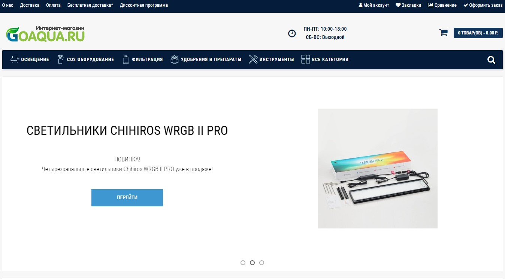

# AutomationQA_diploma_project

# Проект автоматизации тестирования UI для сайта [GoAqua.ru](https://goaqua.ru/)


____

## <a name="Технологии и инструменты">**Технологии и инструменты:**</a>

<br/>
<p align="left">
<a href="https://www.python.org/"></a> 
<a href="https://www.jetbrains.com/pycharm/"></a> 
<a href="https://www.selenium.dev/"></a>
<a href="https://github.com/allure-framework"></a>
<a href="https://github.com/"></a>  
</p>

____

## <a name="Начало работы">**Начало работы:**</a>

Github - склонировать проект себе на ПК для последующего запуска и тестирования.

Для запуска тестов на вашем ПК должно быть установлено следующее ПО:

- PyCharm IDEA
- Allure
- Google Chrome (или другой браузер)

---

## <a name="Запуск тестов">**Запуск тестов:**</a>

1. Запускаем авто-тесты командой в терминале:

```
pytest -v --alluredir=tests\allure_results
```

2. Генерируем отчёт по итогам тестирования с помощью Allure. Отчёт автоматически откроется в браузере с помощью команды
   в терминале:

```
allure serve .\tests\allure_results
```

После генерации и работы с отчётом, останавливаем работу allureServe в терминале сочетанием клавиш CTRL + C и
подтверждаем действие в терминале вводом Y.
___

## </a> <a name="Allure"></a>Allure [отчет](test-documentation/Report.md)</a>

___

### *Основная страница отчёта*

<p align="center">  
  
</p>  

### *Тест-кейсы*

<p align="center">  
  
</p>

### *Графики*

  <p align="center">  
  
  
</p>

### <a name="Ссылки на документацию и отчеты:">**Ссылки на документацию и отчеты:**</a>

[План автоматизации тестирования](test-documentation/Plan.md)\
[Отчет о проведенном тестировании](test-documentation/Report.md)\
[Отчет о проведенной автоматизации](test-documentation/Summary.md)

